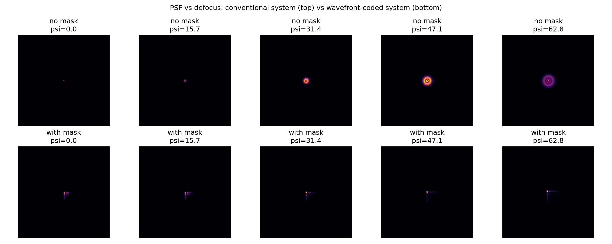
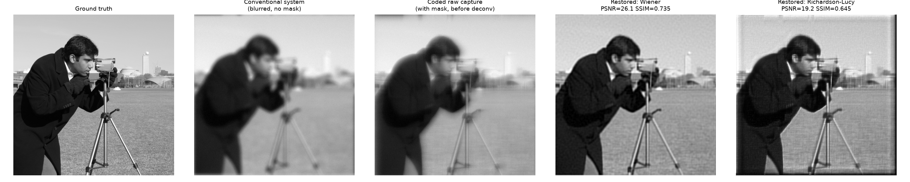

# Wavefront Coding Simulation for Extended Depth of Field

Simulation of a computational imaging system that combines a **cubic
phase mask** (optical wavefront coding) with **digital deconvolution**
(Wiener filter / Richardson-Lucy) to achieve depth-of-field invariance
and image restoration.

## Motivation

In a conventional optical system, the point-spread function (PSF)
changes drastically with defocus, making blind restoration difficult.
By introducing a cubic phase mask in the pupil plane, the PSF becomes
approximately **invariant to defocus** — the raw image always has the
same type of blur, regardless of the actual defocus amount. Because
the PSF is then known and constant, a single fixed digital filter can
restore a sharp image across a wide depth range.

This is a core example of **co-design in computational imaging**:
optical hardware (the phase mask) and a reconstruction algorithm are
designed together, rather than optimizing each in isolation.

## Method

1. **Pupil model**: circular aperture with a phase term combining
   defocus (`psi * (x^2 + y^2)`) and a cubic phase mask
   (`alpha * (x^3 + y^3)`).
2. **PSF computation**: `PSF = |FFT(pupil)|^2`, via Fourier optics.
3. **Depth-invariance check**: PSF and MTF are compared across several
   defocus levels, with and without the cubic mask.
4. **Forward simulation**: a ground-truth test image is convolved with
   the coded PSF and Gaussian noise is added, to simulate a raw sensor
   capture.
5. **Restoration**: the raw capture is deconvolved using the known PSF
   via (a) Wiener filtering and (b) Richardson-Lucy iterative
   deconvolution.
6. **Evaluation**: restored images are compared to ground truth using
   PSNR and SSIM.

## Repository structure

```
.
├── wavefront_coding.py     # core functions (PSF, MTF, blur, deconvolution)
├── run_experiment.py       # runs the full pipeline, saves figures to results/
├── requirements.txt
├── results/                # output figures and metrics (generated)
└── README.md
```

## How to run

```bash
pip install -r requirements.txt
python run_experiment.py
```

Results (PSF comparison, MTF comparison, restoration comparison, and
`metrics.txt`) are saved to the `results/` folder.

## Results

**PSF vs. defocus** — conventional system (top) shows a strongly
defocus-dependent PSF (a growing ring pattern), while the
wavefront-coded system (bottom) keeps an approximately constant PSF
shape across the same defocus range:



**Restoration** — ground truth, conventional blur, coded raw capture,
and restored images (Wiener and Richardson-Lucy):



| Method           | PSNR (dB) | SSIM |
|------------------|-----------|------|
| Wiener filter    | see `results/metrics.txt` | |
| Richardson-Lucy  | see `results/metrics.txt` | |

## Possible extensions

- Sweep `alpha` (mask strength) to quantify the depth-invariance /
  contrast trade-off.
- Add illumination coding (structured illumination) alongside pupil
  phase coding.
- Replace the fixed Wiener filter with a learned (CNN-based) restoration
  model and compare.

## Author

[Your name] — Master's student in Optics, [university]. Project built
as part of a self-directed exploration of computational imaging and
wavefront coding, related to research at Télécom SudParis / SAMOVAR.
